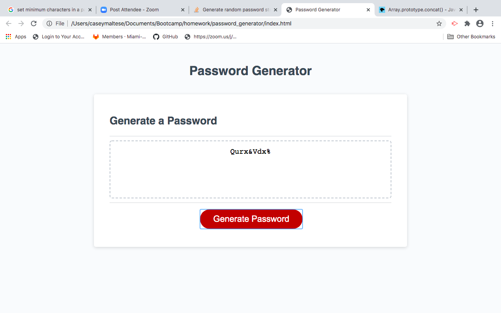

# password_generator
homework3

This is a random password generator.  There are three separate files for the html, css, and js.  A screenshot is also included in the assets folder.  The user interface is very neat and the page is responsive on devices of all sizes.  The random password generator includes several prompts and confirms in order for the user to get a random password that inludes numbers, special characters, uppercase letters, and lowercase letters.

Deployed: https://caseofbase18.github.io/password_generator/

